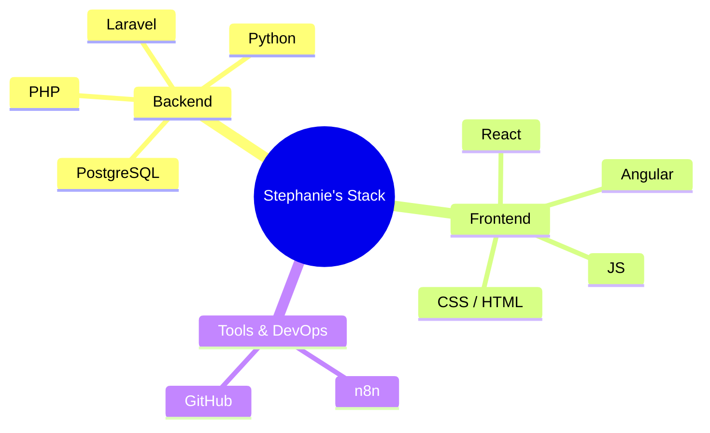

  <!-- Header Banner -->
  

    

  <!-- Connect Section -->
  <h3>Connect</h3>

  
  
  

## 🔗 Sobre mí

* 🎓 **Tecnóloga en Análisis y Desarrollo de Software (SENA)** — graduación esperada en 2026.
* 🛠️ Proyecto Formativo **FlowZone**, un sistema web de gestión turística y reservas para el mercado colombiano.
* 🐍 Aprendiendo **Python** y dando mis primeros pasos en **automatización con n8n**.
* 🅰️ Iniciando también con **Angular** como tercer framework frontend.
* 🗣️ **Español nativo** – inglés B1 (en formación hacia C1).
* ⚡ Pensamiento lógico, debugging y trabajo en equipo.

 

## 🚀 Tecnologías y herramientas

  
    
  
  
  

 

  
🅰️ <b>Angular</b> · 🐍 <b>Python</b> · 🔗 <b>n8n</b> → <i>en proceso de aprendizaje activo</i>

 

### 🗺️ Mapa de Habilidades (Stephanie's Stack)

 

## 📌 Proyectos destacados

<table>
  <tr>
    <td width="50%" valign="top">
      <h3>🌴 FlowZone</h3>
      
Sistema web de gestión turística para Colombia, con roles múltiples (visitantes, usuarios, empresas) y panel admin.

      

        
        
        
        
      

    </td>
    <td width="50%" valign="top">
      <h3>💱 Conversor de Divisas</h3>
      
App en React con consumo de API en tiempo real y manejo de estados.

      

        
      

    </td>
  </tr>
</table>

 

## 📊 Estadísticas de GitHub

  
  

 

  

 

---

  <i>Gracias por visitar mi perfil 💋</i>

